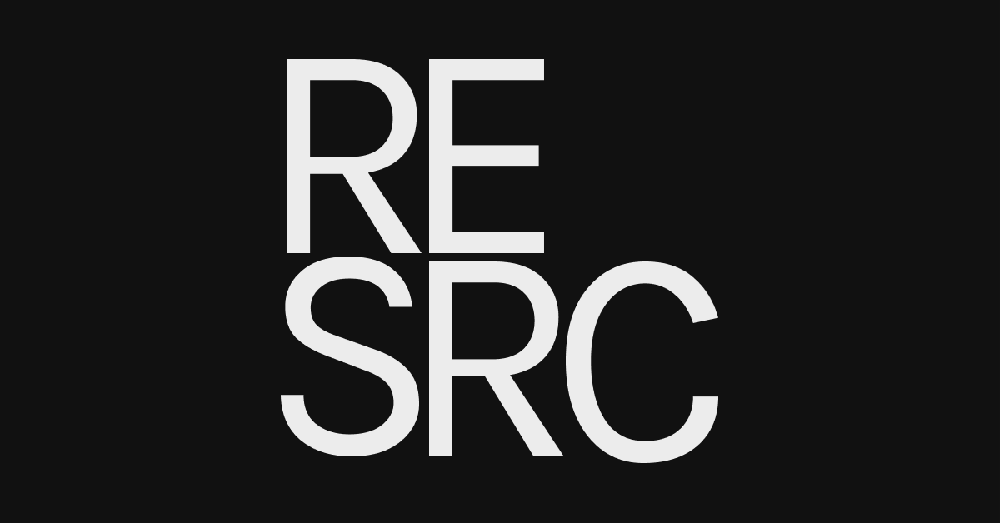

  

<strong>Software Development Resources</strong>

Curated by <a href="https://sunnysingh.io/">Sunny Singh</a>

---

## 📖 How it works

[Resrc](https://resrc.dev/) is a resources site powered by [Airtable](https://airtable.com/). Data is sourced via the web clipper and imported via a [Gastby](https://gatsbyjs.org/) plugin. This allows for a seamless curating experience.

## 🚀 Development

Resrc is built with [Gastby](https://gatsbyjs.org/), [Chakra UI](https://chakra-ui.com/), [React Query](https://react-query.tanstack.com/).

Make sure you have [NVM](https://github.com/nvm-sh/nvm#readme) installed.

1. Use Node.js version: `nvm use`
2. Install dependencies: `npm install`
3. Copy env: `cp example.env .env` (set API keys in `.env`)
4. Launch server: `npm start`

Some functionality such as serverless functions require a Netlify environment. You can set it up by doing:

1. Log in `npm run netlify:login`
2. Launch server: `npm run netlify:dev`
